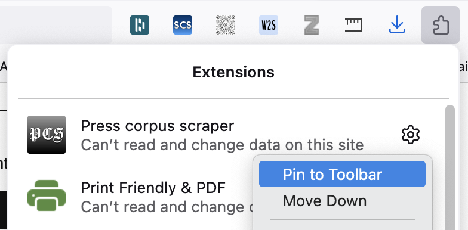
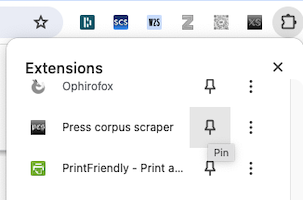
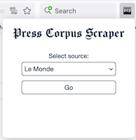

([**English version**](https://fmoncomble.github.io/press-corpus-scraper/README_EN.html))

Une extension pour extraire et télécharger des articles de presse à des fins de fouille textuelle.  
  
**Important :** La collecte de données, limitée aux besoins de la recherche, est encadrée par la loi sur le droit d'auteur et la propriété intellectuelle ainsi que par les conditions d'utilisation des différents fournisseurs de services.

🚨 **Nouveau !** 🚨 Prise en charge d'Europresse : connectez-vous via [le portail de votre établissement](europresse-list.md).

### Citer ce programme

Si vous utilisez cette extension pour vos travaux de recherche, merci de la référencer de la façon suivante :

Moncomble, F. (2024). _Press Corpus Scraper_ (Version 0.10) [JavaScript]. Arras, France : Université d’Artois. Disponible à l'adresse : https://fmoncomble.github.io/press-corpus-scraper/

## Installation

### Firefox (recommandé : mises à jour automatiques)

La validation de l'extension par Mozilla peut prendre du temps. Si vous voulez essayer la dernière version :
-   Installez [Firefox Developer Edition](https://www.firefox.com/en-GB/channel/desktop/developer/?redirect_source=mozilla-org) ;
-   Dans la barre d'adresse, tapez `about:config` puis la touche Entrée ;
-   Cliquez sur `Accepter le risque et continuer` ;
-   Cherchez `xpinstall.signatures.required` ;
-   Réglez sur `False` ;
-   Cliquez [ici](https://github.com/fmoncomble/press-corpus-scraper/releases/latest/download/pcs_beta.xpi) pour installer l'extension.

### Navigateurs basés sur Chromium (Chrome, Edge, Opera, Ecosia...)

-   ⚠️ Ces navigateurs ne sont plus pris en charge. Une refonte de l'extension est à l'étude pour la rendre à nouveau compatible.
~~-   [Télécharger l'archive .zip](https://github.com/fmoncomble/press-corpus-scraper/releases/latest/download/pcs.zip)~~
~~-   Décompresser l'archive~~
~~-   Ouvrir le gestionnaire d'extensions : `chrome://extensions` ou `edge://extensions`~~
    ~~-   Activer le « mode développeur »~~
    ~~-   Cliquer sur « charger l'extension non empaquetée »~~
    ~~-   Sélectionner le dossier décompressé~~

Pensez à épingler l'extension à la barre d'outils :  
 

## Mode d'emploi

-   Cliquer sur l'icône dans la barre d'outils et sélectionner une source :
    
-   ou naviguer vers un site pris en charge :
    -   [_Le Figaro_](https://recherche.lefigaro.fr/)
    -   [_L'Humanité_](https://www.humanite.fr/)
    -   [_Le Monde_](https://www.lemonde.fr/recherche/)
    -   [_Le Point_](https://www.lepoint.fr/recherche/index.php)
    -   [_The Guardian_](https://www.theguardian.com/)
    -   [_The New York Times_](https://www.nytimes.com/)
    -   [_Deutsches Zeitungsportal_](https://www.deutsche-digitale-bibliothek.de/newspaper)
    -   [_Süddeutsche Zeitung_](https://www.sueddeutsche.de/)
    -   ou le portail **Europresse** de votre établissement : [liste des établissements pris en charge](europresse-list.md)
-   **Europresse & sites de journaux :**

    -   Effectuer une recherche par mot-clef
    -   (Facultatif : affiner la recherche)
    -   Un encadré apparait en haut de la page de résultats. Exemple du _Monde_ :
        
    -   Choisir l'option d'extraction puis cliquer sur `Extraire`
        -   Les articles réservés aux abonnés ne sont pas téléchargés mais listés sous forme de liens
        -   Les articles que l'extension échoue à extraire sont listés sous forme de liens
        -   A l'issue de l'extraction :
            -   Firefox : l'archive .zip contenant les fichiers est automatiquement téléchargée dans le dossier par défaut
            -   Chrome/Edge : sélectionner le dossier de destination de l'archive .zip

-   **Guardian & New York Times :**

    -   Cliquer sur le bouton `PCScraper` en haut à droite dans la barre de menus du site pour ouvrir la fenêtre de recherche
        Exemple du _New York Times_ :  
        

    -   Construire une requête dans l'interface, puis cliquer sur `Search`
    -   Choisir `Extract all` ou `Extract sample`
    -   Cliquer sur `Extract articles`
    -   Sélectionner le format de fichier souhaité : `TXT`, `XML/XTZ` (pour import dans [TXM](https://txm.gitpages.huma-num.fr/textometrie/) à l'aide du module `XML-TEI Zero + CSV`) ou `Iramuteq`
    -   Cliquer sur `Download`

### Limites et problèmes connus

-   **Sites de journaux :** même avec un compte abonné actif, il se peut que l'extension n'ait pas accès au texte intégral des articles premium (lorsque le cookie n'est pas accepté par le serveur distant). Dans ce cas, seuls les articles en accès libre sont récupérés, les autres étant listés sous forme de liens.
    -   _L'Humanité :_ à défaut d'abonnement, il est conseillé de créer un compte gratuit sur le site.
-   **Europresse :**
    -   affiche les métadonnées des articles de façon très aléatoire, sans éléments HTML dédiés, ce qui peut donner lieu à des incohérences dans la structure des fichiers téléchargés (chapô en lieu et place du nom d'auteur.e, etc.). Ce n'est pas un problème de l'extension mais d'Europresse !
    -   n'autorise l'extraction que de 20 pages de résultats (1000 articles) à la fois.
-   **Deutsches Zeitungsportal :**
    -   l'API renvoie des pages entières de journaux et non des articles individuels ;
    -   les textes ayant numérisés par reconnaissance optique de caractères (OCR), les journaux imprimés en Fraktur donnent des résultats inégaux.
-   **_Guardian_ et _New York Times_ :** la recherche s'appuie sur les API offertes par ces deux publications. Une clef d'accès est requise ; son obtention est gratuite et automatique aux liens suivants :
    -   [_The Guardian_](https://bonobo.capi.gutools.co.uk/register/developer)
    -   [_The New York Times_](https://developer.nytimes.com/get-started)
-   **_New York Times_ :** un abonnement actif est indispensable pour accéder au texte intégral de tous les articles, il faut donc être connecté à son compte au préalable. Le serveur distant accepte le cookie envoyé par l'extension (pour le moment), mais celle-ci doit composer avec certaines limitations et dispositifs de sécurité :
    -   les requêtes ne renvoient que 10 résultats à la fois, et l'API n'autorise que 5 requêtes par minute : celles-ci sont donc espacées de 12 secondes pour éviter tout blocage
    -   le serveur bloque les accès trop nombreux et trop rapides : le contenu des articles n'est donc extrait qu'à raison d'1 article par seconde. Malgré cela, un blocage peut survenir : l'extension invite alors à cliquer sur un lien pour prouver qu'on n'est pas un robot...
    -   le compte abonné peut être déconnecté à tout moment : l'extension se met alors en pause et invite à cliquer sur un lien d'authentification afin de pouvoir reprendre la récupération de contenu.
-   **_The New York Times_ sous Firefox :** à cause de la façon dont Firefox gère le chargement dynamique de la [page d'accueil](https://www.nytimes.com), celle-ci doit être ouverte dans un nouvel onglet ou une nouvelle fenêtre. Dans le cas contraire, le bouton de l'extension apparait brièvement avant de disparaitre.
