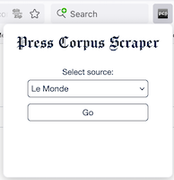

([**Version française**](https://fmoncomble.github.io/press-corpus-scraper))

An extension for extracting and downloading press articles for text mining.

🚨 **New!** 🚨 Support for Europresse: log in via [your institutional portal](europresse-list.md).

### Cite this program

If you use this extension for your research, please reference it as follows:

Moncomble, F. (2024). _Press Corpus Scraper_ (Version 0.8) [JavaScript]. Arras, France: Université d'Artois. Available at: https://fmoncomble.github.io/press-corpus-scraper/

## Installation

### Firefox (recommended: automatic updates)

### Chrome/Edge

-   [Download .zip archive](https://github.com/fmoncomble/press-corpus-scraper/releases/latest/download/pcs.zip)
-   Unzip the archive
-   Open the extensions manager: `chrome://extensions` or `edge://extensions`
    -   Activate "developer mode"
    -   Click "Load unpacked".
    -   Select the unzipped folder

Remember to pin the extension to the toolbar:  

## Instructions for use

-   Click the icon in the toolbar and choose a source:
    
-   or navigate to a supported website:
    -   [_Le Figaro_](https://recherche.lefigaro.fr/)
    -   [_L'Humanité_](https://www.humanite.fr/)
    -   [_Le Monde_](https://www.lemonde.fr/recherche/)
    -   [_Le Point_](https://www.lepoint.fr/recherche/index.php)
    -   [_The Guardian_](https://www.theguardian.com/)
    -   [_The New York Times_](https://www.nytimes.com/)
    -   [_Deutsches Zeitungsportal_](https://www.deutsche-digitale-bibliothek.de/newspaper)
    -   or your institution's Europresse portal: [list of supported institutions](europresse-list.md)
-   **French websites and Europresse:**
    -   Search by keyword
    -   (Optional: refine your search)
    -   A box appears at the top of the results page. Example for _Le Monde_ :  
        
    -   Choose an extraction option and click `Extract`
        -   Paywalled articles are not downloaded but listed as links
        -   Articles that the extension fails to process are listed as links
        -   When extraction is complete :
            -   Firefox: the .zip archive containing the files is automatically downloaded to the default folder
            -   Chrome/Edge: select the destination folder for the .zip archive
-   **Other sites:**

    -   Click on the `PCScraper` button in the top right-hand corner of the site's menu bar to open the search window
        Example from the _New York Times_ :  
        

    -   Build a query in the interface, then click `Search`
    -   Choose `Extract all` or `Extract sample`
    -   Click `Extract articles`
    -   Select the desired file format: `TXT`, `XML/XTZ` (for import into [TXM](https://txm.gitpages.huma-num.fr/textometrie/) with the `XML-TEI Zero + CSV` module) or `Iramuteq`
    -   Click `Download`

### Known issues and limitations

-   **French sites:** even with an active subscription, the extension may not have access to the full text of paywalled articles (if the cookie is not accepted by the remote server). In that case, only free-access articles are retrieved, the others being listed as links.
    -   _L'Humanité:_ without a subscription, it is advised to create a free account.
-   **Europresse**
    -   handles article metadata rather randomly, with no dedicated HTML elements, which can lead to some inconsistency in the way they are rendered in downloaded files (subheads where author name should belong, etc.). This is not a limitation of the add-on but of Europresse!
    -   only allows scraping 20 pages of results (1000 articles) at a time.
-   **Deutsches Zeitungsportal:**
    -   the API returns whole newspaper pages, not individual articles;
    -   because texts are produced by Optical Character Recognition, newspapers originally printed in Fraktur yield mixed results.
-   **_Guardian_ and _New York Times_:** the query and extraction process relies on the APIs offered by these two publications. An access key is required, which can be obtained free of charge from the following links:
    -   [_The Guardian_](https://bonobo.capi.gutools.co.uk/register/developer)
    -   [_The New York Times_](https://developer.nytimes.com/get-started)
-   **_The New York Times_:** an active subscription is required to access the full text of all articles, so you need to be logged into your account first. The remote server accepts the cookie sent by the extension (for the time being), but there are a number of limitations and security features:
    -   requests can only return 10 results at a time, and the API only authorises 5 requests per minute: these are therefore spaced 12 seconds apart to avoid any blocking
    -   the server blocks fetch requests that are too numerous and too fast: to avoid that, article content is only retrieved at a rate of 1 article per second. Despite this, a block may occur: the extension then invites you to click on a link to prove that you are not a robot...
    -   the subscriber account can be disconnected at any time: the extension then pauses and prompts you to click on an authentication link before resuming content retrieval.
-   **_The New York Times_ on Firefox:** due to the way Firefox handles the dynamic loading of [the NYT's homepage](https://www.nytimes.com), it needs to be opened in a new tab or window for the button to appear. In any other case, the button is likely to pop up briefly before disappearing.
