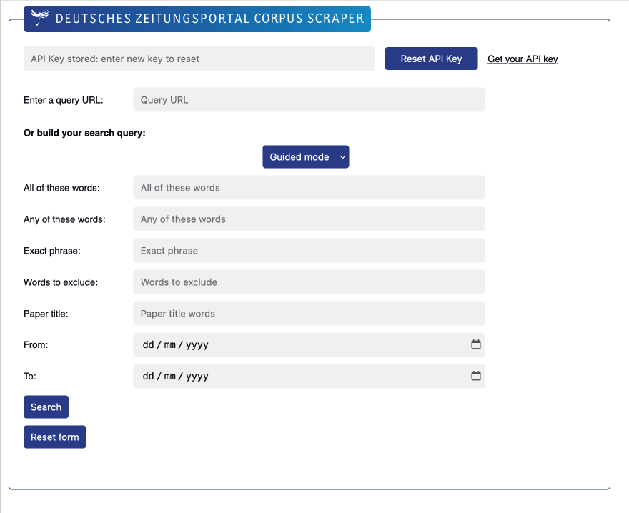
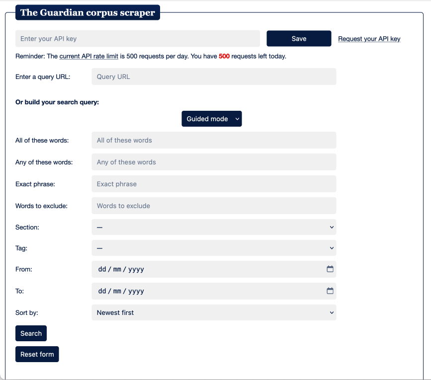

# Changelog

**_Press Corpus Scraper_ has been updated!** Here are the new features:

### 0.8.4

-   Added update notification mechanism for Firefox users.
-   Improved UI for choosing Europresse institutional partner.

### 0.8.1-0.8.3

-   Bug fixes.
-   Added changelog.
-   Added update notification mechanism for Chrome/Edge users.

## 0.8

-   Enhanced user interaction with toolbar button and popup for source selection.  
    
    -   Remember to pin the extension to the toolbar!  
        
-   **New!** Added support for the [**_Deutsches Zeitungsportal_**](https://www.deutsche-digitale-bibliothek.de/newspaper?lang=en), a collection of historical German newspapers from 1671 to 1994.  
    
    -   Limitations:
        -   The API returns whole newspaper pages rather than individual articles.
        -   The digitization of older newspaper issues printed in Fraktur may not be reliable.

## 0.7

-   _NYT_ and _Guardian_: improved file generation method, separating article extraction and file building into two different processes. This enables the user to generate multiple file types without repeating the extraction process, thus reducing the number of API calls.

## 0.6

-   **New!** Added support for the generation of text files formatted for Iramuteq.
-   UI bug fixes.

## 0.5

-   Overhauled query building for _Guardian_ and _NYT_ with two modes, `Guided` and `Expert`.
    

### 0.4.6-0.4.8

-   Bug fixes
-   Added API rate limit handling for _The Guardian_.

### 0.4.5

-   Bug fix for generating acceptable Windows file names, removing reserved / illegal characters and words, and removing diacritics.

### 0.4.1-0.4.4

-   Bug fixes.

## 0.4

-   **New!** Added support for Europresse

### 0.3.7

-   _NYT_: display remaining API calls.

### 0.3.6

-   _NYT_: added support for connection errors and subscriber logout.

### 0.3.5

-   **New!** Added support for _L'Humanité_.
-   Bug fixes.

### 0.3.1-0.3.4

-   Bug fixes.

## 0.3

-   **New!** Added support for _The Guardian_ and _The New York Times_ APIs.

### 0.2.3

-   **New!** Added support for _Le Point_.
-   Code optimization.

### 0.2.2

-   Added option to extract all result pages or only the page currently displayed.

### 0.2.1

-   Bug fixes.

## 0.2

-   Interface update.

### 0.1.4

-   Multi-site version.

### 0.1.1-0.1.3

-   Bug fixes.

## 0.1

-   Initial version.
